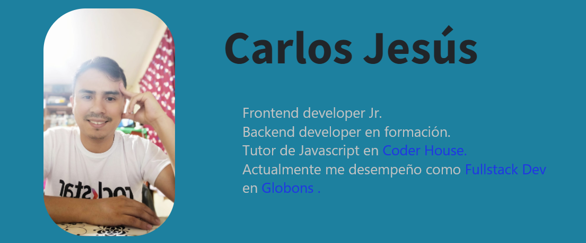

### Hi there 👋

<!--
**carlos0718/carlos0718** is a ✨ _special_ ✨ repository because its `README.md` (this file) appears on your GitHub profile.

Here are some ideas to get you started:

- 🔭 I’m currently working on ...
- 🌱 I’m currently learning ...
- 👯 I’m looking to collaborate on ...
- 🤔 I’m looking for help with ...
- 💬 Ask me about ...
- 📫 How to reach me: ...
- 😄 Pronouns: ...
- ⚡ Fun fact: ...
-->

<h1 align="center">Hola 👋, soy Fullstack developer Jr.</h1>

<h2>🔭 Sobre mi :</h2>  <h3 style="align-item: justify">Soy un joven apacionado por la tecnología, y de nuevos desafíos en la vida. Desde adolescente me interesó el mundo de la computación. Empecé trabajando como soporte técnico en distintas empresas como #Telefónica, #Megatech, #Atos, #Atento y de manera freelance. 
 
  En la facultad conocé el mundo de la programación, y desde ese momento decidé no salir de ese mundo tan imprisionante y complicado a la vez. Ahora soy junior developer, trabajando con las técnologías de #HTML, #CSS, #Javascript, #React, #Angular, #Asp.net Core, #SQL Server. Pero eso no queda ahí, ahora me estoy capacitando en Node JS para entrar al mundo del backend</h3>

---

<h2 align="left">🔭 Tecnologías</h2>

                     

---
<!--
<h2 align="left">🔭 Contactame</h2>

-->
---

<h2>🔭 Dedicatoria </h2> <h3 style="align-item: justify">Todo mi progreso y dedicación se lo dedico a mi madre, Rocio M. Jesús S., que me enseño a dar pelea a las batallas de la vida, a no rendirme ante nada, que podemos decaer pero al otro día levantarnos para seguir dando pelea a la vida y llegar a conseguir mis sueños, ella es mi Madre, la que desde el cielo me cuida, me guía y me ilumina. I MISS YOU MOM </h3>
<svg viewBox="-16 -32 880 192" width="880" height="192" xmlns="http://www.w3.org/2000/svg"><rect class="c" x="2" y="2" width="12" height="12"/><rect class="c" x="2" y="18" width="12" height="12"/><rect class="c" x="2" y="34" width="12" height="12"/><rect class="c" x="2" y="50" width="12" height="12"/><rect class="c" x="2" y="66" width="12" height="12"/><rect class="c" x="2" y="82" width="12" height="12"/><rect class="c" x="2" y="98" width="12" height="12"/><rect class="c" x="18" y="2" width="12" height="12"/><rect class="c" x="18" y="18" width="12" height="12"/><rect class="c" x="18" y="34" width="12" height="12"/><rect class="c" x="18" y="50" width="12" height="12"/><rect class="c" x="18" y="66" width="12" height="12"/><rect class="c" x="18" y="82" width="12" height="12"/><rect class="c" x="18" y="98" width="12" height="12"/><rect class="c" x="34" y="2" width="12" height="12"/><rect class="c" x="34" y="18" width="12" height="12"/><rect class="c" x="34" y="34" width="12" height="12"/><rect class="c" x="34" y="50" width="12" height="12"/><rect class="c" x="34" y="66" width="12" height="12"/><rect class="c" x="34" y="82" width="12" height="12"/><rect class="c" x="34" y="98" width="12" height="12"/><rect class="c" x="50" y="2" width="12" height="12"/><rect class="c" x="50" y="18" width="12" height="12"/><rect class="c" x="50" y="34" width="12" height="12"/><rect class="c" x="50" y="50" width="12" height="12"/><rect class="c" x="50" y="66" width="12" height="12"/><rect class="c" x="50" y="82" width="12" height="12"/><rect class="c" x="50" y="98" width="12" height="12"/><rect class="c" x="66" y="2" width="12" height="12"/><rect class="c" x="66" y="18" width="12" height="12"/><rect class="c" x="66" y="34" width="12" height="12"/><rect class="c" x="66" y="50" width="12" height="12"/><rect class="c" x="66" y="66" width="12" height="12"/><rect class="c" x="66" y="82" width="12" height="12"/><rect class="c" x="66" y="98" width="12" height="12"/><rect class="c" x="82" y="2" width="12" height="12"/><rect class="c" x="82" y="18" width="12" height="12"/><rect class="c" x="82" y="34" width="12" height="12"/><rect class="c" x="82" y="50" width="12" height="12"/><rect class="c" x="82" y="66" width="12" height="12"/><rect class="c" x="82" y="82" width="12" height="12"/><rect class="c" x="82" y="98" width="12" height="12"/><rect class="c" x="98" y="2" width="12" height="12"/><rect class="c" x="98" y="18" width="12" height="12"/><rect class="c" x="98" y="34" width="12" height="12"/><rect class="c" x="98" y="50" width="12" height="12"/><rect class="c" x="98" y="66" width="12" height="12"/><rect class="c" x="98" y="82" width="12" height="12"/><rect class="c" x="98" y="98" width="12" height="12"/><rect class="c" x="114" y="2" width="12" height="12"/><rect class="c" x="114" y="18" width="12" height="12"/><rect class="c" x="114" y="34" width="12" height="12"/><rect class="c" x="114" y="50" width="12" height="12"/><rect class="c" x="114" y="66" width="12" height="12"/><rect class="c" x="114" y="82" width="12" height="12"/><rect class="c" x="114" y="98" width="12" height="12"/><rect class="c" x="130" y="2" width="12" height="12"/><rect class="c" x="130" y="18" width="12" height="12"/><rect class="c" x="130" y="34" width="12" height="12"/><rect class="c" x="130" y="50" width="12" height="12"/><rect class="c" x="130" y="66" width="12" height="12"/><rect class="c" x="130" y="82" width="12" height="12"/><rect class="c" x="130" y="98" width="12" height="12"/><rect class="c" x="146" y="2" width="12" height="12"/><rect class="c" x="146" y="18" width="12" height="12"/><rect class="c" x="146" y="34" width="12" height="12"/><rect class="c" x="146" y="50" width="12" height="12"/><rect class="c" x="146" y="66" width="12" height="12"/><rect class="c" x="146" y="82" width="12" height="12"/><rect class="c" x="146" y="98" width="12" height="12"/><rect class="c" x="162" y="2" width="12" height="12"/><rect class="c" x="162" y="18" width="12" height="12"/><rect class="c" x="162" y="34" width="12" height="12"/><rect class="c" x="162" y="50" width="12" height="12"/><rect class="c" x="162" y="66" width="12" height="12"/><rect class="c" x="162" y="82" width="12" height="12"/><rect class="c" x="162" y="98" width="12" height="12"/><rect class="c" x="178" y="2" width="12" height="12"/><rect class="c" x="178" y="18" width="12" height="12"/><rect class="c" x="178" y="34" width="12" height="12"/><rect class="c" x="178" y="50" width="12" height="12"/><rect class="c" x="178" y="66" width="12" height="12"/><rect class="c" x="178" y="82" width="12" height="12"/><rect class="c" x="178" y="98" width="12" height="12"/><rect class="c" x="194" y="2" width="12" height="12"/><rect class="c" x="194" y="18" width="12" height="12"/><rect class="c" x="194" y="34" width="12" height="12"/><rect class="c" x="194" y="50" width="12" height="12"/><rect class="c" x="194" y="66" width="12" height="12"/><rect class="c" x="194" y="82" width="12" height="12"/><rect class="c" x="194" y="98" width="12" height="12"/><rect class="c" x="210" y="2" width="12" height="12"/><rect class="c" x="210" y="18" width="12" height="12"/><rect class="c" x="210" y="34" width="12" height="12"/><rect class="c" x="210" y="50" width="12" height="12"/><rect class="c" x="210" y="66" width="12" height="12"/><rect class="c" x="210" y="82" width="12" height="12"/><rect class="c" x="210" y="98" width="12" height="12"/><rect class="c" x="226" y="2" width="12" height="12"/><rect class="c" x="226" y="18" width="12" height="12"/><rect class="c" x="226" y="34" width="12" height="12"/><rect class="c" x="226" y="50" width="12" height="12"/><rect class="c" x="226" y="66" width="12" height="12"/><rect class="c" x="226" y="82" width="12" height="12"/><rect class="c" x="226" y="98" width="12" height="12"/><rect class="c" x="242" y="2" width="12" height="12"/><rect class="c" x="242" y="18" width="12" height="12"/><rect class="c" x="242" y="34" width="12" height="12"/><rect class="c" x="242" y="50" width="12" height="12"/><rect class="c" x="242" y="66" width="12" height="12"/><rect class="c" x="242" y="82" width="12" height="12"/><rect class="c" x="242" y="98" width="12" height="12"/><rect class="c" x="258" y="2" width="12" height="12"/><rect class="c" x="258" y="18" width="12" height="12"/><rect class="c" x="258" y="34" width="12" height="12"/><rect class="c" x="258" y="50" width="12" height="12"/><rect class="c" x="258" y="66" width="12" height="12"/><rect class="c" x="258" y="82" width="12" height="12"/><rect class="c" x="258" y="98" width="12" height="12"/><rect class="c" x="274" y="2" width="12" height="12"/><rect class="c" x="274" y="18" width="12" height="12"/><rect class="c" x="274" y="34" width="12" height="12"/><rect class="c" x="274" y="50" width="12" height="12"/><rect class="c" x="274" y="66" width="12" height="12"/><rect class="c" x="274" y="82" width="12" height="12"/><rect class="c" x="274" y="98" width="12" height="12"/><rect class="c" x="290" y="2" width="12" height="12"/><rect class="c" x="290" y="18" width="12" height="12"/><rect class="c" x="290" y="34" width="12" height="12"/><rect class="c" x="290" y="50" width="12" height="12"/><rect class="c" x="290" y="66" width="12" height="12"/><rect class="c" x="290" y="82" width="12" height="12"/><rect class="c" x="290" y="98" width="12" height="12"/><rect class="c" x="306" y="2" width="12" height="12"/><rect class="c" x="306" y="18" width="12" height="12"/><rect class="c" x="306" y="34" width="12" height="12"/><rect class="c" x="306" y="50" width="12" height="12"/><rect class="c" x="306" y="66" width="12" height="12"/><rect class="c" x="306" y="82" width="12" height="12"/><rect class="c" x="306" y="98" width="12" height="12"/><rect class="c" x="322" y="2" width="12" height="12"/><rect class="c" x="322" y="18" width="12" height="12"/><rect class="c" x="322" y="34" width="12" height="12"/><rect class="c" x="322" y="50" width="12" height="12"/><rect class="c" x="322" y="66" width="12" height="12"/><rect class="c" x="322" y="82" width="12" height="12"/><rect class="c" x="322" y="98" width="12" height="12"/><rect class="c" x="338" y="2" width="12" height="12"/><rect class="c" x="338" y="18" width="12" height="12"/><rect class="c" x="338" y="34" width="12" height="12"/><rect class="c" x="338" y="50" width="12" height="12"/><rect class="c" x="338" y="66" width="12" height="12"/><rect class="c" x="338" y="82" width="12" height="12"/><rect class="c" x="338" y="98" width="12" height="12"/><rect class="c" x="354" y="2" width="12" height="12"/><rect class="c" x="354" y="18" width="12" height="12"/><rect class="c" x="354" y="34" width="12" height="12"/><rect class="c" x="354" y="50" width="12" height="12"/><rect class="c" x="354" y="66" width="12" height="12"/><rect class="c" x="354" y="82" width="12" height="12"/><rect class="c" x="354" y="98" width="12" height="12"/><rect class="c" x="370" y="2" width="12" height="12"/><rect class="c" x="370" y="18" width="12" height="12"/><rect class="c" x="370" y="34" width="12" height="12"/><rect class="c" x="370" y="50" width="12" height="12"/><rect class="c" x="370" y="66" width="12" height="12"/><rect class="c" x="370" y="82" width="12" height="12"/><rect class="c" x="370" y="98" width="12" height="12"/><rect class="c" x="386" y="2" width="12" height="12"/><rect class="c" x="386" y="18" width="12" height="12"/><rect class="c" x="386" y="34" width="12" height="12"/><rect class="c" x="386" y="50" width="12" height="12"/><rect class="c" x="386" y="66" width="12" height="12"/><rect class="c" x="386" y="82" width="12" height="12"/><rect class="c" x="386" y="98" width="12" height="12"/><rect class="c" x="402" y="2" width="12" height="12"/><rect class="c" x="402" y="18" width="12" height="12"/><rect class="c" x="402" y="34" width="12" height="12"/><rect class="c" x="402" y="50" width="12" height="12"/><rect class="c" x="402" y="66" width="12" height="12"/><rect class="c" x="402" y="82" width="12" height="12"/><rect class="c" x="402" y="98" width="12" height="12"/><rect class="c" x="418" y="2" width="12" height="12"/><rect class="c" x="418" y="18" width="12" height="12"/><rect class="c" x="418" y="34" width="12" height="12"/><rect class="c" x="418" y="50" width="12" height="12"/><rect class="c" x="418" y="66" width="12" height="12"/><rect class="c" x="418" y="82" width="12" height="12"/><rect class="c" x="418" y="98" width="12" height="12"/><rect class="c" x="434" y="2" width="12" height="12"/><rect class="c" x="434" y="18" width="12" height="12"/><rect class="c" x="434" y="34" width="12" height="12"/><rect class="c" x="434" y="50" width="12" height="12"/><rect class="c" x="434" y="66" width="12" height="12"/><rect class="c" x="434" y="82" width="12" height="12"/><rect class="c" x="434" y="98" width="12" height="12"/><rect class="c" x="450" y="2" width="12" height="12"/><rect class="c" x="450" y="18" width="12" height="12"/><rect class="c" x="450" y="34" width="12" height="12"/><rect class="c" x="450" y="50" width="12" height="12"/><rect class="c" x="450" y="66" width="12" height="12"/><rect class="c" x="450" y="82" width="12" height="12"/><rect class="c" x="450" y="98" width="12" height="12"/><rect class="c" x="466" y="2" width="12" height="12"/><rect class="c" x="466" y="18" width="12" height="12"/><rect class="c" x="466" y="34" width="12" height="12"/><rect class="c" x="466" y="50" width="12" height="12"/><rect class="c" x="466" y="66" width="12" height="12"/><rect class="c" x="466" y="82" width="12" height="12"/><rect class="c" x="466" y="98" width="12" height="12"/><rect class="c" x="482" y="2" width="12" height="12"/><rect class="c" x="482" y="18" width="12" height="12"/><rect class="c" x="482" y="34" width="12" height="12"/><rect class="c" x="482" y="50" width="12" height="12"/><rect class="c" x="482" y="66" width="12" height="12"/><rect class="c" x="482" y="82" width="12" height="12"/><rect class="c" x="482" y="98" width="12" height="12"/><rect class="c" x="498" y="2" width="12" height="12"/><rect class="c" x="498" y="18" width="12" height="12"/><rect class="c" x="498" y="34" width="12" height="12"/><rect class="c" x="498" y="50" width="12" height="12"/><rect class="c" x="498" y="66" width="12" height="12"/><rect class="c" x="498" y="82" width="12" height="12"/><rect class="c" x="498" y="98" width="12" height="12"/><rect class="c" x="514" y="2" width="12" height="12"/><rect class="c" x="514" y="18" width="12" height="12"/><rect class="c" x="514" y="34" width="12" height="12"/><rect class="c" x="514" y="50" width="12" height="12"/><rect class="c" x="514" y="66" width="12" height="12"/><rect class="c" x="514" y="82" width="12" height="12"/><rect class="c" x="514" y="98" width="12" height="12"/><rect class="c" x="530" y="2" width="12" height="12"/><rect class="c" x="530" y="18" width="12" height="12"/><rect class="c" x="530" y="34" width="12" height="12"/><rect class="c" x="530" y="50" width="12" height="12"/><rect class="c" x="530" y="66" width="12" height="12"/><rect class="c" x="530" y="82" width="12" height="12"/><rect class="c" x="530" y="98" width="12" height="12"/><rect class="c" x="546" y="2" width="12" height="12"/><rect class="c" x="546" y="18" width="12" height="12"/><rect class="c" x="546" y="34" width="12" height="12"/><rect class="c" x="546" y="50" width="12" height="12"/><rect class="c" x="546" y="66" width="12" height="12"/><rect class="c" x="546" y="82" width="12" height="12"/><rect class="c" x="546" y="98" width="12" height="12"/><rect class="c" x="562" y="2" width="12" height="12"/><rect class="c" x="562" y="18" width="12" height="12"/><rect class="c" x="562" y="34" width="12" height="12"/><rect class="c" x="562" y="50" width="12" height="12"/><rect class="c" x="562" y="66" width="12" height="12"/><rect class="c" x="562" y="82" width="12" height="12"/><rect class="c" x="562" y="98" width="12" height="12"/><rect class="c" x="578" y="2" width="12" height="12"/><rect class="c" x="578" y="18" width="12" height="12"/><rect class="c" x="578" y="34" width="12" height="12"/><rect class="c" x="578" y="50" width="12" height="12"/><rect class="c" x="578" y="66" width="12" height="12"/><rect class="c" x="578" y="82" width="12" height="12"/><rect class="c" x="578" y="98" width="12" height="12"/><rect class="c" x="594" y="2" width="12" height="12"/><rect class="c" x="594" y="18" width="12" height="12"/><rect class="c" x="594" y="34" width="12" height="12"/><rect class="c" x="594" y="50" width="12" height="12"/><rect class="c" x="594" y="66" width="12" height="12"/><rect class="c" x="594" y="82" width="12" height="12"/><rect class="c" x="594" y="98" width="12" height="12"/><rect class="c" x="610" y="2" width="12" height="12"/><rect class="c" x="610" y="18" width="12" height="12"/><rect class="c" x="610" y="34" width="12" height="12"/><rect class="c" x="610" y="50" width="12" height="12"/><rect class="c" x="610" y="66" width="12" height="12"/><rect class="c" x="610" y="82" width="12" height="12"/><rect class="c" x="610" y="98" width="12" height="12"/><rect class="c" x="626" y="2" width="12" height="12"/><rect class="c" x="626" y="18" width="12" height="12"/><rect class="c" x="626" y="34" width="12" height="12"/><rect class="c" x="626" y="50" width="12" height="12"/><rect class="c" x="626" y="66" width="12" height="12"/><rect class="c" x="626" y="82" width="12" height="12"/><rect class="c" x="626" y="98" width="12" height="12"/><rect class="c" x="642" y="2" width="12" height="12"/><rect class="c" x="642" y="18" width="12" height="12"/><rect class="c" x="642" y="34" width="12" height="12"/><rect class="c" x="642" y="50" width="12" height="12"/><rect class="c" x="642" y="66" width="12" height="12"/><rect class="c" x="642" y="82" width="12" height="12"/><rect class="c" x="642" y="98" width="12" height="12"/><rect class="c" x="658" y="2" width="12" height="12"/><rect class="c" x="658" y="18" width="12" height="12"/><rect class="c c0" x="658" y="34" width="12" height="12"/><rect class="c" x="658" y="50" width="12" height="12"/><rect class="c" x="658" y="66" width="12" height="12"/><rect class="c" x="658" y="82" width="12" height="12"/><rect class="c" x="658" y="98" width="12" height="12"/><rect class="c" x="674" y="2" width="12" height="12"/><rect class="c" x="674" y="18" width="12" height="12"/><rect class="c" x="674" y="34" width="12" height="12"/><rect class="c" x="674" y="50" width="12" height="12"/><rect class="c c1" x="674" y="66" width="12" height="12"/><rect class="c" x="674" y="82" width="12" height="12"/><rect class="c" x="674" y="98" width="12" height="12"/><rect class="c" x="690" y="2" width="12" height="12"/><rect class="c" x="690" y="18" width="12" height="12"/><rect class="c" x="690" y="34" width="12" height="12"/><rect class="c" x="690" y="50" width="12" height="12"/><rect class="c" x="690" y="66" width="12" height="12"/><rect class="c" x="690" y="82" width="12" height="12"/><rect class="c" x="690" y="98" width="12" height="12"/><rect class="c" x="706" y="2" width="12" height="12"/><rect class="c" x="706" y="18" width="12" height="12"/><rect class="c" x="706" y="34" width="12" height="12"/><rect class="c" x="706" y="50" width="12" height="12"/><rect class="c" x="706" y="66" width="12" height="12"/><rect class="c" x="706" y="82" width="12" height="12"/><rect class="c" x="706" y="98" width="12" height="12"/><rect class="c c2" x="722" y="2" width="12" height="12"/><rect class="c" x="722" y="18" width="12" height="12"/><rect class="c" x="722" y="34" width="12" height="12"/><rect class="c" x="722" y="50" width="12" height="12"/><rect class="c" x="722" y="66" width="12" height="12"/><rect class="c" x="722" y="82" width="12" height="12"/><rect class="c c3" x="722" y="98" width="12" height="12"/><rect class="c" x="738" y="2" width="12" height="12"/><rect class="c" x="738" y="18" width="12" height="12"/><rect class="c" x="738" y="34" width="12" height="12"/><rect class="c" x="738" y="50" width="12" height="12"/><rect class="c" x="738" y="66" width="12" height="12"/><rect class="c" x="738" y="82" width="12" height="12"/><rect class="c" x="738" y="98" width="12" height="12"/><rect class="c" x="754" y="2" width="12" height="12"/><rect class="c" x="754" y="18" width="12" height="12"/><rect class="c" x="754" y="34" width="12" height="12"/><rect class="c" x="754" y="50" width="12" height="12"/><rect class="c" x="754" y="66" width="12" height="12"/><rect class="c" x="754" y="82" width="12" height="12"/><rect class="c" x="754" y="98" width="12" height="12"/><rect class="c" x="770" y="2" width="12" height="12"/><rect class="c" x="770" y="18" width="12" height="12"/><rect class="c" x="770" y="34" width="12" height="12"/><rect class="c" x="770" y="50" width="12" height="12"/><rect class="c" x="770" y="66" width="12" height="12"/><rect class="c" x="770" y="82" width="12" height="12"/><rect class="c" x="770" y="98" width="12" height="12"/><rect class="c" x="786" y="2" width="12" height="12"/><rect class="c" x="786" y="18" width="12" height="12"/><rect class="c" x="786" y="34" width="12" height="12"/><rect class="c" x="786" y="50" width="12" height="12"/><rect class="c" x="786" y="66" width="12" height="12"/><rect class="c" x="786" y="82" width="12" height="12"/><rect class="c" x="786" y="98" width="12" height="12"/><rect class="c" x="802" y="2" width="12" height="12"/><rect class="c c4" x="802" y="18" width="12" height="12"/><rect class="c" x="802" y="34" width="12" height="12"/><rect class="c" x="802" y="50" width="12" height="12"/><rect class="c" x="802" y="66" width="12" height="12"/><rect class="c" x="802" y="82" width="12" height="12"/><rect class="c" x="802" y="98" width="12" height="12"/><rect class="c" x="818" y="2" width="12" height="12"/><rect class="c" x="818" y="18" width="12" height="12"/><rect class="c" x="818" y="34" width="12" height="12"/><rect class="c" x="818" y="50" width="12" height="12"/><rect class="c" x="818" y="66" width="12" height="12"/><rect class="c" x="818" y="82" width="12" height="12"/><rect class="c" x="818" y="98" width="12" height="12"/><rect class="c" x="834" y="2" width="12" height="12"/><rect class="u u0" height="12" width="339.8" x="0.0" y="144"/><rect class="u u1" height="12" width="509.4" x="339.2" y="144"/><rect class="s s0" x="0.8" y="0.8" width="14.4" height="14.4" rx="4.5" ry="4.5"/><rect class="s s1" x="1.8" y="1.8" width="12.3" height="12.3" rx="4.1" ry="4.1"/><rect class="s s2" x="2.6" y="2.6" width="10.8" height="10.8" rx="3.6" ry="3.6"/><rect class="s s3" x="3.0" y="3.0" width="9.9" height="9.9" rx="3.3" ry="3.3"/></svg>
